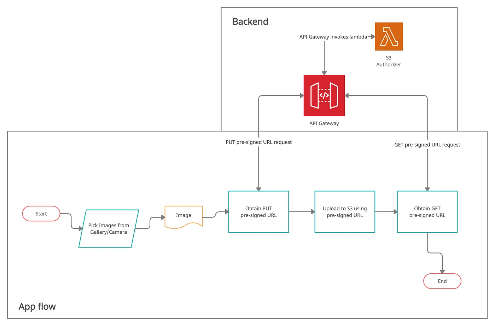
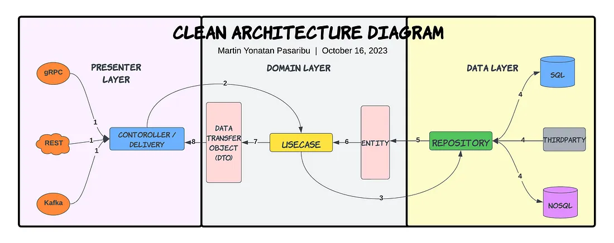

# Meradia



## Overview

Meradia is a web application that facilitates image uploading to Amazon S3 storage. It leverages ReactJS for the frontend and Golang for the backend. The application follows a three-step process to upload an image to S3 storage.

## Process

1. **Obtain Presigned URL from Backend**: The frontend sends an HTTP request to the backend to obtain a presigned URL. The backend, configured with Amazon S3 access, generates this URL with upload access and an expiration time.

2. **Upload Image to S3 using Presigned URL**: The frontend uses the presigned URL to upload the image to S3. This is achieved by making an HTTP POST request to the presigned URL with the image data.

3. **Confirm Upload and Save Information to Backend**: Once the upload is complete, the frontend notifies the backend. The backend confirms the upload, saves the image information, and returns a link to the saved image for frontend access.

Please note that the detailed setup of each step may vary depending on your requirements and configuration.

## Getting Started

Before starting, ensure you understand the [flow](flow.png) and how to use the **imageproxy** [here](https://github.com/willnorris/imageproxy).

---
### Prerequisites

- Linux OS (latest Ubuntu or your choice of distro) is recommended. Windows may not be compatible with Docker and other technologies we use.
- Docker CE (latest) and docker-compose
- Git for source code management
- IDE of your choice (Goland or VS Code recommended)

### Development

1. Clone the repository: `https://gitlab.com/merakilab9/meradia.git`
2. Add .env file as per .env.example
3. Start the development environment with Docker: `make compose dev`

After starting, services will be available at localhost with the following ports:
- Backend: 8099
- ImageProxy: 8022

## API Testing

### Testing api:

#### 1. **PreUpload**: Obtain a presigned URL
    ```curl
    curl --location 'localhost:8099/api/v1/media/pre-upload' \
    --header 'Content-Type: application/json' \
    --data '{
        "media_type": "png"
    }'
    ```

#### 2. **Upload**: Upload the image to S3 (Backend test only; Frontend will use presigned URL to upload)
* get [PRESIGN_URL] from PreUpload api response
```curl
curl --location 'localhost:8099/api/v1/media/upload' \
--form 'upload_url="[PRESIGN_URL]"' \
--form 'file=@"/C:/Users/AlienWare/Downloads/3 copy 1.png"'
```

#### 3. **PosUpload**: Confirm the upload and save the image information to the backend
* get [FILE_NAME] from PreUpload api response
```curl
curl --location 'localhost:8099/api/v1/media/pos-upload' \
--header 'Content-Type: application/json' \
--data '{
    "name": "[FILE_NAME]",
    "media_type": "png",
    "type_to_crop": "avatar"
}'
```

For detailed curl commands for each API endpoint, please refer to the original README.


#### Contact for support:
- web: https://pxthang.com
- mail: pxthang97@gmail.com

---
# Understand the source code:



- The source code, written in Golang, follows the Golang standard layout. 
- It is divided into three main parts: **handler**, **service**, and **repository**. 
- Each part has its own responsibility, ensuring the code is clean and easy to maintain. 
  - The handler handles HTTP requests, 
  - The service implements business logic
  - The repository interacts with the database or external services. 
- This separation of concerns makes the code more modular, testable, and maintainable.